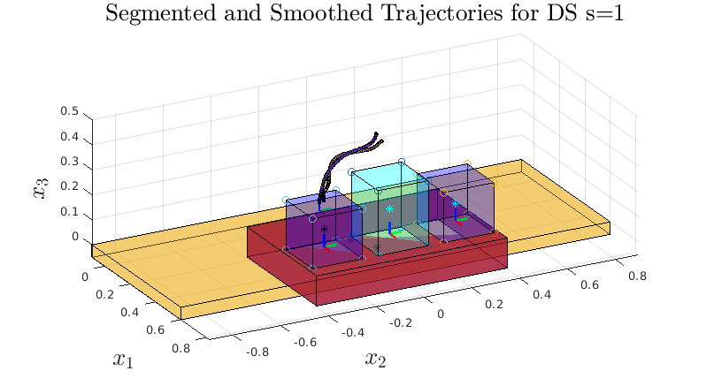
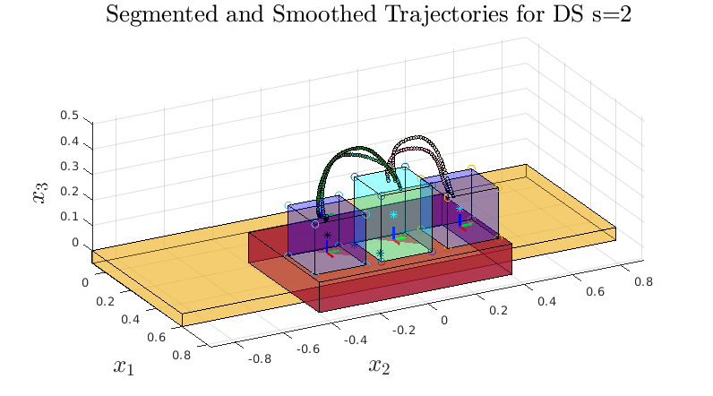
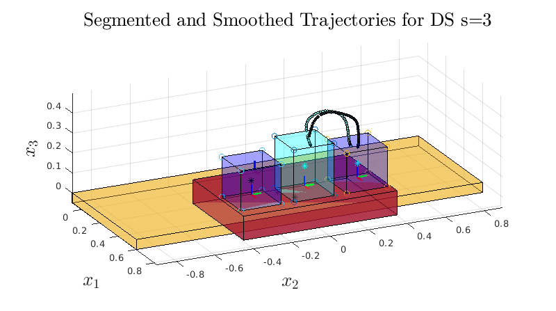

# rosbag_to_mat
Adapted my old/archived [my_matlab_rosbag](https://github.com/nbfigueroa/my_matlab_rosbag) code to work with the ROS Toolbox for MATLAB (v2019 and up). 

## Data collection is as follows:
1.  **Record Demonstrations as ROSbags:** Record demonstrations as time-series of geometry_msgs::PoseStamped (for position and orientation, WrenchStamped can be used for FT messages) messages in rosbags. A repo that provides useful code (for different robots) and launch files in ROS for easy data collection can be found in the [easy-kinesthetic-recording](https://github.com/nbfigueroa/easy-kinesthetic-recording) package.
2.  **Extract Trajectories from ROSbags to MATLAB:** Extract desired messages and create trajectories of matlab structures (containing all pose information) stored in .mat. **See examples below.**
3.  **Segment Trajectories:** In this repo you will find the scripts to define segmentation points when gripper state has opened/closed -- this is only useful for pick-and-place tasks! For continuous tasks that are not defined by gripper changes a seperate segmentation algorithm must be used, such as the one being developed in [dsltl](https://github.com/yanweiw/dsltl) which is used for some of the tasks below.
---

## Examples

### Industrial Task
The script ``xsens_mitsubishi_process_rosbags.m`` loads the rosbags that were recorded by tracking the right hand of a human operator with the [Xsens MVN](https://www.xsens.com/products/mtw-awinda) Motion Capture system and workspace object locations via a dual-kinect setup using the AprilTags detection algorithm as designed for the [Mitsubishi Cobot Assista MIT Project](https://github.com/mit-meau/melfa_cobot).

   

**Note:** This script only extracts the trajectories from the saved rosbags and converts them to the robot's reference frame. 

**Trajectory Segmentation:** In order to learn individual goal-oriented motion policies (such as attractor-based Dynamical Systems)  from this data one must segment the trajectories. For this task a state-change segmentation algorithm is used to cluster trajectories corresponding to different known action proposition (AP) regions. This approach is under development/in preparation for submission by [Felix Yanwei Wang](https://yanweiw.github.io/) and [Nadia Figueroa](https://nbfigueroa.github.io/), see [dsltl](https://github.com/yanweiw/dsltl).
 

### Household Tasks
#### Cooking preparation task 
This task involves scooping and mixing ingredients from bowls. The script ``franka_cooking_process_rosbags.m`` loads the rosbags recorded by tracking the end-effector for the franka emika panda during kinesthetic demonstrations as shown below:

	
	

This kinesthetic teaching example is documented in the [franka_interactive_controllers](https://github.com/nbfigueroa/franka_interactive_controllers/blob/main/doc/instructions/kinesthetic_teaching_recording.md) package or the [easy-kinesthetic-recording](https://github.com/nbfigueroa/easy-kinesthetic-recording) package on the ``latest-franka`` branch.

   

**Note:** The ``franka_cooking_process_rosbags.m`` script only extracts the trajectories as shown above. 

**Trajectory Segmentation:** In order to learn individual goal-oriented motion policies (such as attractor-based Dynamical Systems) from this data one must segment the trajectories into clusters as shown below: 

   

The same segmentation algorithm for the industrial task is used here. See [dsltl](https://github.com/yanweiw/dsltl) or contact [Felix Yanwei Wang](https://yanweiw.github.io/) and/or [Nadia Figueroa](https://nbfigueroa.github.io/).

#### Table setting task 
Involves grasping plates/cutlery from dish rack and placing it on a table. The script ``franka_tablesetting_process_rosbags.m``loads the rosbags recorded by tracking the end-effector for the franka emika panda during kinesthetic demonstrations as shown in the kinesthetic teaching example with the  [franka_interactive_controllers](https://github.com/nbfigueroa/franka_interactive_controllers/blob/main/doc/instructions/kinesthetic_teaching_recording.md) package or the [easy-kinesthetic-recording](https://github.com/nbfigueroa/easy-kinesthetic-recording) package on the ``latest-franka`` branch.

   

**Gripper State-Based Trajectory Segmentation**
Since these continuous demonstrations involving a series of pick-and-place tasks we can automatically segment the trajectories into goal-oriented clusters based on the state of the of gripper and the object locations where the gripper grasped/released an object.

*To fill:...*

## Contact
[Nadia Figueroa](https://nbfigueroa.github.io/) (nadiafig AT seas dot upenn dot edu)

